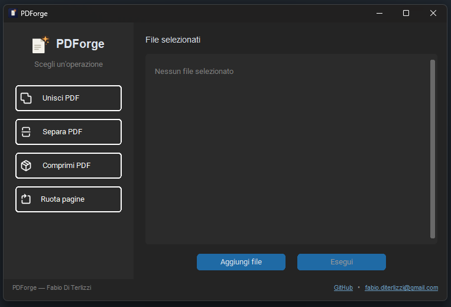

# 📄 PDForge

**PDForge** è un'applicazione per la gestione rapida dei file PDF: unione, separazione, compressione e altre utilità, il tutto in un'unica app leggera e semplice da usare.
Il progetto nasce anche come percorso di apprendimento di Python.

👤 **Autore:** Fabio Di Terlizzi ([@biets](https://github.com/biets))



---

## ✨ Funzionalità

- ✅ **Unione PDF** — combina più file PDF in un unico documento
- 🔧 **Separazione PDF** — estrae singole pagine o intervalli da un PDF (in fase di integrazione GUI)
- 🔧 **Compressione PDF** — riduce il peso dei file tramite ricompressione di stream e immagini (in fase di integrazione GUI)
- 🔧 **Rotazione pagine** — ruota una o più pagine di un documento (in sviluppo)
- ✅ **Conteggio pagine** — utility di lettura rapida dei metadati del PDF

> Legenda: ✅ completato · 🔧 in sviluppo

---

## 🛠️ Tecnologie utilizzate

- **Python 3** — linguaggio principale
- **[CustomTkinter](https://github.com/TomSchimansky/CustomTkinter)** — interfaccia grafica
- **[pypdf](https://pypdf.readthedocs.io/)** — manipolazione PDF (unione, separazione, compressione stream)
- **[pikepdf](https://pikepdf.readthedocs.io/)** — compressione avanzata
- **[Pillow](https://pillow.readthedocs.io/)** — ricompressione delle immagini incorporate

---

## 📁 Struttura del progetto

```
PDForge/
├── core/                   # Logica di business (nessuna dipendenza dalla GUI)
│   ├── read_pdf.py         # Lettura metadati (conta_pagine)
│   ├── merge_pdf.py        # Unione PDF (merge_pdf / unisci_pdf)
│   ├── split_pdf.py        # Separazione PDF (split_pdf)
│   ├── compress_pdf.py     # Compressione stream
│   └── compress_images.py  # Ricompressione immagini
├── gui/                    # Interfaccia grafica (CustomTkinter)
├── tests_files/            # File PDF di prova
├── main.py                 # Entry point dell'applicazione
├── requirements.txt        # Dipendenze del progetto
└── README.md
```

---

## 🚀 Installazione

```bash
# Clona il repository
git clone https://github.com/biets/PDForge.git
cd PDForge

# Crea un ambiente virtuale (consigliato)
python -m venv venv
venv\Scripts\activate      # Windows

# Installa le dipendenze
pip install -r requirements.txt
```

## ▶️ Utilizzo

```bash
python main.py
```

---

## 🗺️ Roadmap

- [ ] Collegare i pulsanti GUI mancanti (separazione, compressione, rotazione)
- [ ] Migliorare la scalabilità della lista file nella GUI
- [ ] Packaging dell'applicazione in eseguibile standalone (.exe)
- [ ] Test automatizzati

---

## 🤝 Contributi

Progetto personale a scopo di apprendimento — suggerimenti e feedback sono comunque benvenuti tramite issue.

## 📄 Licenza

Distribuito con licenza [MIT](LICENSE).
